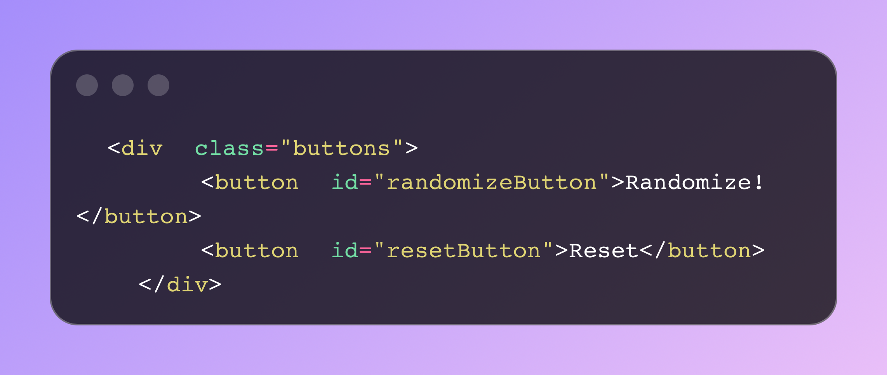
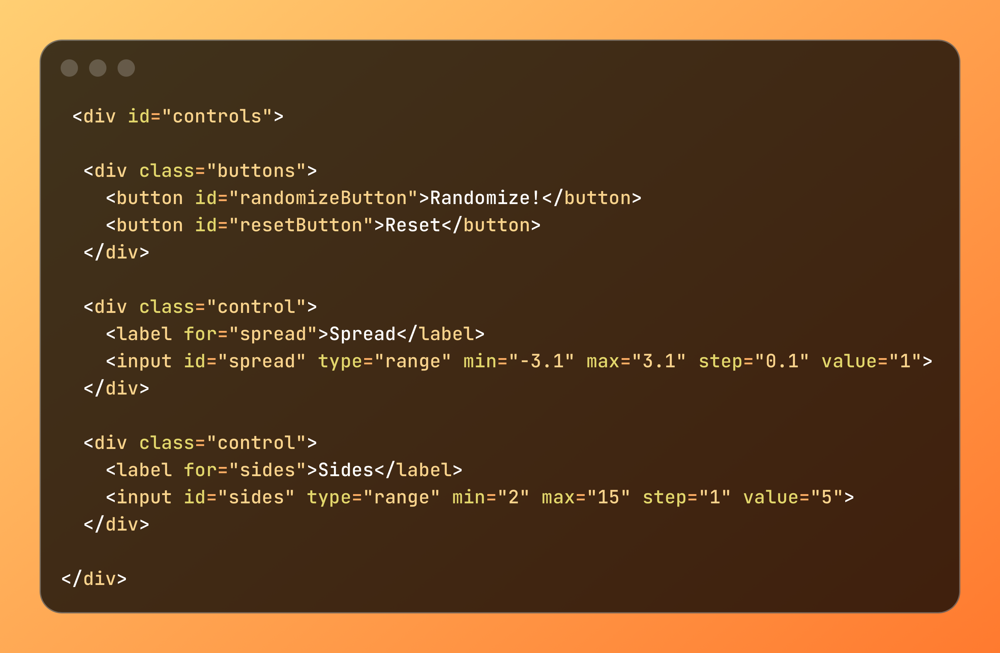
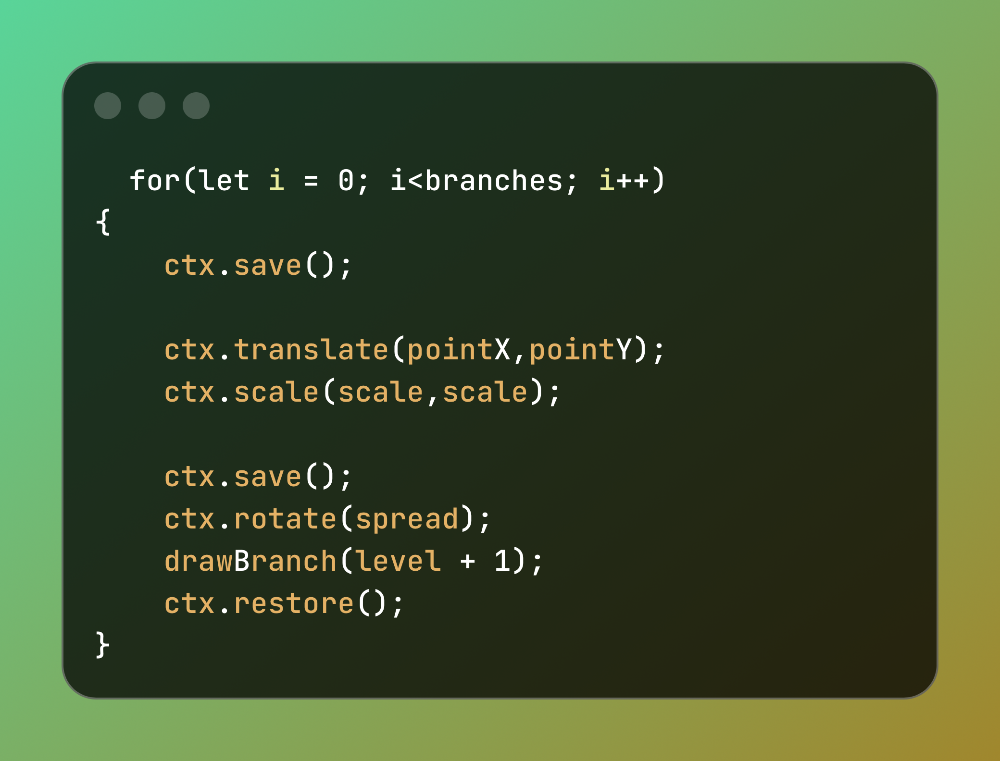
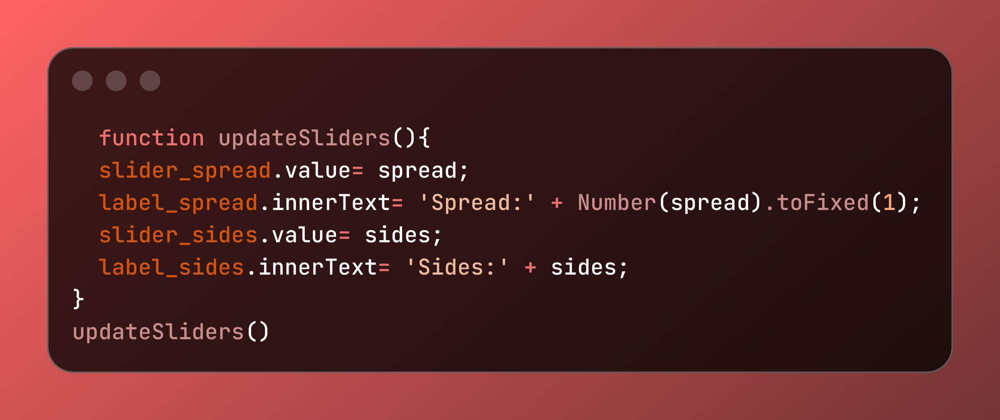

# Creative Coding: Web tool

## 1. Descriptif

### Objectif: Créer une page web interactive où l’utilisateur peut

. Faire apparaître des lignes

. Modifier la forme de l'art génératif créé à l'aide du bouton randomize

. A l'aide des boutons mis à sa disposition augmenter et diminuer les branches et leur expansion

. Reset à une forme basic quand il veut 

## 2. Idées & Références

- lignes
- formes géométriques
- dessn sur canva
- animation 2D
- [Reference 1](https://www.dirtalleydesign.com/blogs/news/visual-design-and-generative-art)
- [Reference 2](https://link.springer.com/article/10.1186/s13731-017-0072-1)
  

## 3. Snippets

 [//]: <> (Dot Code.)

 ### a. Code HTML pour un boutton (randomize)

 ### b. Code HTML pour le centre de controle

 

 ### c. Code js pour une ligne

 

 ### d. Code js pour les sliders

 

 ### e. Code js pour générer un fractal(l'art que l'on va voir sur le canva)

 
